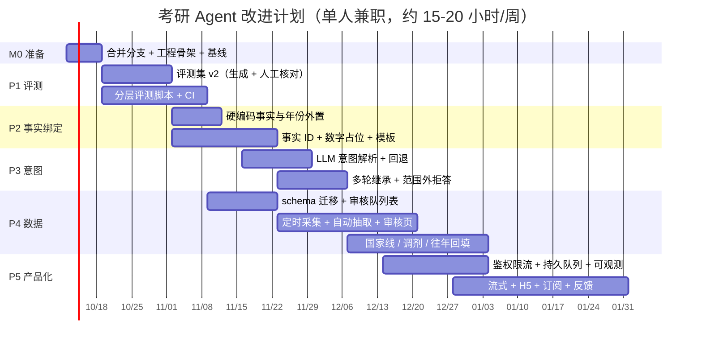
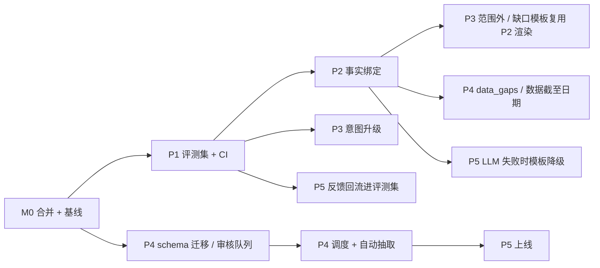

# 考研信息 Agent 改进计划（v1，2026-10-08 起草）

> 依据：对 `ddmashawty/enterprise-document-intelligence-agent` 的 `feat/kaoyan` 分支（HEAD `5a71c22`）的代码评审。所有文件路径均来自该分支。
> 标 **〔待确认〕** 的是我没有验证、或需要你做决定的地方。清单原文保持不动。执行记录从 M0 起写在 `docs/kaoyan_m0_notes.md`。

---

## 0. 目标与衡量方式

**一句话目标：** 把现在的“四校 37 专业演示版”做成考研学生在**出分 → 复试线 → 调剂季（以往年份是次年 2–4 月）**真正敢用的工具。要求有三点：每个数字都能对上官方原文和对应的专业、年份、口径；查不到就明说；官方一更新，库里几天内跟上。

### 总体指标（全部在**评测集 v2 的 test 切分**上测）

| 指标 | 定义 | 现状基线 | 目标（建议值，测完基线后再校准） |
|---|---|---|---|
| 数字精确匹配率（Numeric EM） | 题目要求的 expected_facts 中，回答里数值、年份、口径都正确的比例 | 待测（旧 18 题 smoke 18/18 是调参集成绩，不能当基线） | ≥ 95% |
| 归属正确率（Attribution） | 回答里出现的每个数字，都绑定到正确的“学校 + 专业 + 指标 + 年份”的比例 | 待测（P2 之前只能人工抽检或用 LLM 评审） | ≥ 99% |
| 拒答正确率（Refusal） | 范围外、隐私、数据缺失三类题，该拒的拒、不该拒的不拒（报 precision 和 recall） | 待测 | ≥ 95% / ≥ 95% |
| 引用正确率（Citation） | 每个事实引用的 URL 属于该事实的 expected_sources | 待测 | ≥ 95% |
| 意图解析准确率 | 学校、专业代码、年份、指标、操作类型全部正确的比例 | 待测（含多轮题） | ≥ 90% |
| 检索命中率 hit@5 / MRR | 叙述类题目，金标准文档出现在前 5 的比例 | 旧 18 题：BM25 16/18、hybrid 15/18（样本过小） | 在新集合上测完再定 |
| 延迟 p50 / p95 | `/v1/chat` 端到端 | 待测 | p95 ≤ 15 s〔待确认，取决于 DeepSeek 响应时间〕 |
| 单题成本 | token 数 × 单价（单价写在配置里，不写进代码） | 待测 | 待测完基线后定上限 |
| 数据新鲜度 | 官方发布到库内可查的时间（关键文档类型） | 不可测（目前无调度） | 复试线、调剂类 ≤ 48 h（需人工审核） |

### 假设

- **1 人兼职，约 15–20 小时/周**，计划总长约 **16 周**（2026-10-12 → 2027-01-31）。
- 考研时间锚点按往年规律估计〔待以官方公告确认〕：12 月下旬初试 → 次年 2 月下旬出分 → 3 月复试线 → 3–4 月调剂。**P4 数据流水线和 P5 上线最晚要在 2027 年 2 月中旬前可用**，这是硬期限。
- 只有 DeepSeek API（`deepseek-chat`）可用；CI 需要的 `LLM_API_KEY` secret 由你决定是否配置。

---

## 1. 里程碑总览

| 里程碑 | 周次（日期） | 主要内容 | 出口标准 |
|---|---|---|---|
| **M0 准备** | W1（10/12–10/18） | 合并分支、补工程骨架、测基线 | `main` 包含 K6/K7；`pytest` 全绿；旧 18 题跑出一份带 token 和耗时的基线报告 |
| **M1 评测（P1）** | W2–W4（10/19–11/08） | 评测集 v2、分层评测脚本、CI | 评测集 ≥ 150 题，test 切分冻结；CI 每次提交跑 L0–L2 |
| **M2 事实绑定（P2）** | W4–W6（11/02–11/22） | 事实 ID、数字占位与模板、硬编码外置 | 归属正确率在 dev 上 ≥ 99%；`prompts.py` 里不再出现具体学校的事实 |
| **M3 意图（P3）** | W6–W8（11/16–12/06） | LLM 结构化解析、多轮继承、范围外拒答 | 意图准确率 ≥ 90%；多轮和范围外子集 ≥ 90% |
| **M4 数据流水线（P4）** | W7–W12（11/23–01/03），schema 部分从 W5 开始并行 | 定时采集 → 自动抽取 → 审核队列 → 发布；国家线、调剂、往年数据 | 一次完整的“新公告 → 可查”演练 ≤ 48 h；四校 2024–2026 复试线入库 |
| **M5 产品化（P5）** | W10–W16（12/14–01/31），骨架部分在 M0 先做 | 鉴权限流、持久队列、流式、可观测、H5、订阅、反馈回流 | 线上内测可用；每次请求都记录 token、耗时、成本；反馈能进 dev 评测集 |



**依赖关系与并行：**



- **必须串行：** P1 先于 P2 和 P3，否则改进效果无法衡量；P2 的事实 ID 先于 P3 的拒答模板和 P5 的模板降级。
- **可以并行：** P4 的 schema 和审核队列与 P1、P2 同时进行（基本只涉及 `kaoyan/` 和 `collect/`，和 `agent/` 几乎不冲突）；P5 的 pyproject、Docker、LICENSE 在 M0 就能做。

---

## M0 准备（W1，约 3–4 人天）

- [ ] **合并 `feat/kaoyan` 到 `main`。** 我在本地确认 `main` 是 `origin/feat/kaoyan` 的祖先，可以直接 fast-forward。合并前在 `feat/kaoyan` 上跑 `PYTHONPATH=src pytest -q`；我在 box 上的结果是 246 passed / 4 skipped。
- [ ] 新增 `pyproject.toml`：
  - 把 `requirements*.txt` 的分组改成 extras（`[embedding]`、`[ocr]`、`[frontend]`、`[dev]`）；
  - 配置 `ruff`；
  - 把 `pytest.ini` 的 `pythonpath` 迁过去，去掉命令行里的 `PYTHONPATH=src`。
- [ ] 新增 `LICENSE`：代码用 MIT 或 Apache-2.0〔你来决定〕。数据的版权说明见“风险”一节。
- [ ] **测基线：** 用现有 `scripts/smoke_kaoyan.py` 跑一遍旧 18 题，额外记录每题的 token（LangChain 的 `AIMessage.usage_metadata`）和耗时，保存为 `docs/baseline_2026-10.json`。这一步只是给“旧集合”留个快照，不作为新指标的基线。
- [ ] 把 `progress.md`、`task_plan.md` 的规划部分指向本计划，避免两套计划并存。

---

## P1 评测集重建 + CI（M1，W2–W4，约 8–10 人天）

### 设计：评测集 v2 结构（`data/gold/kaoyan_eval_v2.jsonl`，一行一题）

```json
{
  "id": "sl-sysu-670-085404-2026-01",
  "split": "dev | test | adversarial",
  "category": "score_line | plan | subjects | tm | compare | filter | narrative | export | multi_turn | out_of_scope | privacy | unknown_data | year_mismatch | cross_attribution",
  "turns": ["中大计算机学院 085404 的复试线？", "那华工呢？"],
  "school": ["scut"],
  "program_ids": ["scut-xxx-085404"],
  "year": 2026,
  "expected_intent": {"operation": "lookup", "metrics": ["score_line"], "schools": ["scut"], "codes": ["085404"], "year": 2026, "follow_up": true},
  "expected_facts": [
    {"table": "score_lines", "program_id": "...", "kind": "college", "year": 2026, "value": 379, "source_doc_id": "sysu-078"}
  ],
  "expected_refusal": null,
  "expected_sources": ["https://cse.sysu.edu.cn/article/3475"],
  "must_include": [],
  "must_not_include": ["学院线300"],
  "origin": "db_template | handwritten | paraphrase | user_log",
  "reviewed_by": "", "reviewed_at": "",
  "notes": ""
}
```

- 多轮题的 `turns` 只评最后一轮，前面几轮作为上下文依次喂入。
- `expected_refusal` 取值：`out_of_scope` / `privacy` / `unknown_data` / `null`。
- `expected_facts` 直接引用库里的键。这样“数字对不对”和“数字归属对不对”可以分开判。

### 任务清单

- [ ] `scripts/build_gold_candidates.py`（新增）：
  - 遍历 `kaoyan.db` 的 programs × 指标（复试线、计划各口径、科目、推免），按模板生成候选题，并自动填好 `expected_facts`；
  - 每个专业每个指标最多 1–2 题，避免某一类题过多；
  - 再用 DeepSeek 生成 1–2 个口语化改写（如“中大计院专硕去年多少分进复试”），**生成后必须人工核对**。
- [ ] 手写约 40 题“真实学生问法”。参考常见论坛的提问风格，但**自己写，不要复制他人帖子原文**。
- [ ] **对抗集 adversarial**，每类 ≥ 10 题：
  - 范围外学校（北大、深大、华农）；
  - 隐私（问名单里的人）；
  - 问错年份（问 2028）；
  - 跨校混淆（四校对比后追问其中一个）；
  - 推免上限陷阱（“≤N”）；
  - 一级学科统筹（暨南 0812）；
  - 边界项（中大 765 的 085400）；
  - 仅招推免（no_exam）。
- [ ] 旧 18 题迁移进来，**全部放进 dev**（它们已经被调参用过）。
- [ ] **切分规则：**
  - test 约占 30%，按“学校 × 类别”分层抽样，抽完就冻结，只在里程碑验收时运行，日常改提示词只看 dev；
  - test 题改动要在 PR 里单独说明理由；
  - 目标总量 ≥ 150 题（dev 约 90 / test 约 45 / adversarial ≥ 60，adversarial 单独报告）。
- [ ] `src/doc_agent/eval/`（新增包）：
  - `metrics.py`：Numeric EM、Attribution、Refusal P/R、Citation、意图准确率、hit@k/MRR；
  - `runner.py`：读取 jsonl，按层运行。
- [ ] `scripts/eval_kaoyan.py`（新增，替代 `scripts/smoke_kaoyan.py`；旧脚本保留到 M2 结束）：

  | 层 | 内容 | 需要 LLM | 运行时机 |
  |---|---|---|---|
  | L0 | 意图：现在的 `guardrails.detect_kaoyan_intent` 对比 `expected_intent` | 否 | 每次提交 |
  | L1 | 工具：用金标准意图调用 `kaoyan_flow.structured_calls`，检查工具输出是否包含全部 `expected_facts`。这一层能区分“库里没有”和“模型没写对” | 否 | 每次提交 |
  | L2 | 检索：`rag/store.py` 的 BM25 在 narrative 子集上的 hit@5 / MRR（dense 部分有 Ollama 时才跑） | 否 | 每次提交 |
  | L3 | 端到端：`run_agent`，算全部指标，加 token、耗时、成本 | 是 | 每晚或手动 |

- [ ] 需要人工判断的指标（P2 之前的 Attribution）：
  - `--judge` 模式用 DeepSeek 做评审，并抽 20 题人工复核来校准评审的准确度；
  - 评审提示词放在 `src/doc_agent/eval/judge_prompt.py`。
- [ ] `.github/workflows/ci.yml`（新增）：在 Python 3.12 上运行 `ruff check`、`pytest -q`、`scripts/seed_kaoyan.py`、`scripts/extract_kaoyan.py`、`eval_kaoyan.py --layers L0,L1,L2`。L0–L2 的 dev 指标比 `main` 上次结果下降超过 2 个百分点时 CI 失败。
- [ ] `.github/workflows/nightly-eval.yml`（新增，可选）：跑 L3，需要你在仓库 Settings 里配置 `LLM_API_KEY` secret〔你来决定；不配置就只做本地手动跑〕。
- [ ] 报告输出到 `docs/eval/<date>.md` 和 `.json`，带 commit hash。

**验收：**
- 评测集 ≥ 150 题，100% 人工核对过（`reviewed_by` 非空）；
- CI 在一个干净环境里 10 分钟内跑完 L0–L2；
- 第一次 L3 基线报告产出，以后所有改动都和它比。

**风险：** 从库里模板生成的题只能检验“回答和库是否一致”，不能检验“库和官方是否一致”。后者靠 P4 的人工审核和抽检官方原文。

---

## P2 事实绑定的数字校验 + 硬编码外置（M2，W4–W6，约 8–10 人天）

### 现状问题（代码证据）

- `agent/guardrails.py` 的 `find_unsupported_numbers` 只检查“这个数字在证据里出现过没有”。`kaoyan_flow._evidence_blocks` 把所有工具输出拼成一个 `raw` 字符串。所以 A 校的 379 被写到 B 校名下，也能通过校验。
- `kaoyan/query.py` 的 `_merge` 会合并同一个值的多条来源，但合并后的事实**没有稳定 ID**，无法被引用。
- 写死的事实和年份：
  - `agent/prompts.py` 中 `KAOYAN_FINAL_SYSTEM` 第 6、7 条（华工目录被拦、中大 765 边界项、暨南 0812 统筹）；
  - `tools/kaoyan.py:86` 的 `year: int = 2026`；
  - `kaoyan_flow.py:108` 的 `year or 2026`；
  - `api/routes_kaoyan.py:89` 的 `Query(2026, …)`；
  - `kaoyan/seed.py:45` 的 `SCORE_LINE_YEAR = 2026`，以及种子备注里解析出的 2026/2027 正则（种子相关的可以保留，但要改用变量）。

### 设计：事实 ID + 占位符渲染

1. **生成事实 ID**（`kaoyan/query.py`）：在 `_meta()` 里加 `fact_id`，规则是
   `fid = "<table>:<program_id>:<kind|scope>:<year>:<pool_scope or ->:" + sha1(value|upper_bound|source_doc_ids)[:6]`
   这个 ID 对合并后的事实保持稳定，同一事实多个来源时来源列表也计入哈希。
2. **给模型看的证据改为短编号**（`tools/kaoyan.py` 的 `llm_view`）：每条事实加短别名 `F1`、`F2`…，在 state 里保存 `{F1: fid}` 映射，存到 `facts["fact_map"]`。
3. **模型输出规则**（`prompts.py` 新规则）：所有来自证据的数字一律写成 `[[F3]]`，不直接写数字；派生说明（如“≥X”）也必须引用对应的事实编号。
4. **渲染**（新增 `src/doc_agent/kaoyan/render.py`）：
   - `[[Fk]]` 替换为 `value_text`，并在句末或表格行尾自动加来源（标题、URL、发布日期）；
   - 引用的编号不存在时，标“依据不足”并记录到 validation 里。
5. **归属校验**（`kaoyan_flow.finalize`）：
   - 每个 `[[Fk]]` 所在的句子或表格行里，如果出现了学校名、专业代码，必须和这条事实的 `program_id` 一致，不一致就判为错位；
   - 错位时先重写一次，仍错位就删掉该数字；
   - 原有的“裸数字”校验 `find_unsupported_numbers` 保留，作为第二道防线。
6. **模板直出**：单专业、单指标的问题（意图 operation=lookup，事实数 ≤ 3）直接用模板生成回答，不调用 LLM，省成本也零幻觉。这个模板也是 P5 中“LLM 超时或失败时降级”的兜底答案。
7. **数据缺口表**（`kaoyan/schema.sql` 新表）：

```sql
CREATE TABLE IF NOT EXISTS data_gaps (
    id INTEGER PRIMARY KEY AUTOINCREMENT,
    school_id TEXT NOT NULL REFERENCES schools(id),
    program_id TEXT REFERENCES programs(id),   -- NULL = 全校级
    year INTEGER,
    metric TEXT NOT NULL,         -- catalog / subjects / score_line / plan / ...
    status TEXT NOT NULL,         -- blocked / not_published / pooled / tm_only / boundary
    reason TEXT NOT NULL,         -- “yanzhao.scut.edu.cn 统一认证拦截”等
    verify_at TEXT,               -- 去哪里核实（URL）
    source_doc_id TEXT REFERENCES documents(id),
    updated_at TEXT NOT NULL
);
```

   - 由 `kaoyan/seed.py` 从 `majors.csv` 的备注和 `sources.json` 填充；
   - `kaoyan_flow.gap_notes` 改为查这张表；
   - 删除 prompts 第 6、7 条里的具体事实，只保留“遇到 data_gaps 如何表述”的通用规则。
8. **年份外置**：
   - `config.py` 加 `kaoyan_current_cycle`（可选，默认为空）；
   - `kaoyan/query.py` 加 `latest_year(metric, program_id=None)`，从库里取 `MAX(year)`；
   - 上面列出的 2026 默认值全部改为“用户指定 > 配置 > 库里最新”。

### 任务清单

- [ ] `kaoyan/query.py`：给事实加 `fact_id`，加 `latest_year()`；补单元测试 `tests/test_kaoyan_fact_ids.py`，验证 ID 稳定、合并后不变。
- [ ] `tools/kaoyan.py`：`llm_view` 输出 Fk 别名；`citations_from_output` 带上 `fact_id`。
- [ ] `agent/kaoyan_flow.py`：`_evidence_blocks` 生成 fact_map；`finalize` 改为“模板直出 / LLM + 占位渲染 + 归属校验”。
- [ ] 新增 `kaoyan/render.py` 和 `tests/test_kaoyan_render.py`，测试包括：跨校错位被拦、编号不存在、表格行归属。
- [ ] `agent/prompts.py`：新增占位规则；删除写死的事实；`KAOYAN_RETRY_PROMPT` 改为提示错位的编号。
- [ ] `kaoyan/schema.sql` 加 `data_gaps`，`kaoyan/seed.py` 填充；补 `tests/test_kaoyan_seed.py` 的断言。
- [ ] 去掉年份写死：`tools/kaoyan.py:86`、`kaoyan_flow.py:108`、`routes_kaoyan.py:89`、`kaoyan/seed.py:45`。
- [ ] `frontend/kaoyan_view.py`：来源显示为卡片（标题、日期、链接）〔可选〕。

**验收（dev 集 L3）：**
- Attribution ≥ 99%，Numeric EM 不低于 P1 基线；
- 跨校混淆对抗题 100% 不错位；
- `rg "华工|中大|暨南|华师|765|0812" src/doc_agent/agent/prompts.py` 只命中学校简称说明，不命中事实；
- `rg "2026" src/doc_agent --glob '!**/extract/**' --glob '!**/sites.json'` 不再命中业务默认值。

**风险：** DeepSeek 不一定稳定地使用占位符。缓解：重写一次，再加上裸数字校验兜底；L3 里统计“占位遵从率”，低于 95% 就把更多题型改成模板直出。

---

## P3 意图理解升级（M3，W6–W8，约 7–9 人天）

### 现状问题（代码证据，均已在 box 上实测）

- `guardrails.detect_kaoyan_intent` 只靠正则：
  - “那华工呢？”识别为 kinds=`narrative`，丢了上一轮的专业和指标；
  - “广州哪些学校软件工程好考”判为 `is_kaoyan=False`，掉进企业提示词；
  - “北大计算机复试线”判为考研，但 schools 为空，只会检索四校文本，没有说明“不在覆盖范围”。
- `nodes.plan_node` 在考研分支里不读 `session_context`。

### 设计：意图 JSON（Pydantic 模型，新增 `src/doc_agent/agent/intent.py`）

```python
class KaoyanIntent(BaseModel):
    domain: Literal["kaoyan", "enterprise", "chitchat"]
    operation: Literal["lookup", "filter", "compare", "export", "narrative", "chitchat"]
    metrics: list[Literal["score_line", "plan", "subjects", "tm", "directions", "stats", "national_line", "transfer"]]
    schools: list[str]                 # 必须能被 normalize.resolve_school 解析
    mentioned_unknown_schools: list[str]  # 提到了但不在覆盖范围的学校
    codes: list[str]                   # 6 位专业代码或 4 位学科前缀
    colleges: list[str]
    name_keywords: list[str]
    year: int | None
    filters: dict                      # is_408 / study_mode / degree_type / min_public_plan
    follow_up: bool                    # 是否省略了上文的实体
    privacy: bool
    confidence: float
```

**解析流程（`nodes.plan_node` 调用 `intent.parse(goal, prev_slots)`）：**

1. 规则先跑：现有 `detect_kaoyan_intent` 保留，抽出专业代码、年份、学校别名这些确定性信号。
2. LLM 解析：DeepSeek 的 JSON 输出模式（`response_format={"type": "json_object"}`〔待确认当前 DeepSeek 对 JSON 模式和 function calling 的支持细节〕），提示词放 `prompts.INTENT_SYSTEM`。输入包括当前问题、上一轮的 slots、四校别名表。超时设 8 s。
3. 合并与校验：
   - 专业代码、年份**以正则为准**（LLM 不能凭空编代码）；
   - LLM 给出的学校必须能被 `normalize.resolve_school` 解析，否则移入 `mentioned_unknown_schools`；
   - 专业代码必须在 `programs` 表里存在，否则写进 gap note。
4. LLM 失败、超时或解析不出时，完全回退到正则结果，并记录 `intent_source="regex_fallback"`。
5. **多轮继承**：
   - 在 `memory/__init__.py` 的 `TaskStore` 里新增 `session_slots(session_id, slots_json, updated_at)` 表；
   - `follow_up=True` 时，从上一轮继承 schools、codes、metrics、year 中缺失的部分，**本轮明确给出的字段覆盖继承值**；
   - 继承了哪些字段要写进 trace，方便调试。
6. **范围外拒答**：`mentioned_unknown_schools` 非空，且 `schools` 为空时，不调工具，直接返回模板：
   > “目前只覆盖中大 / 华工 / 暨大 / 华师的泛计算机类专业；X 的信息请到其研究生院官网或研招网核实。”

   部分在范围内、部分不在时，只回答在范围内的部分，并说明另一部分不在范围。

### 任务清单

- [ ] 新增 `agent/intent.py` 和 `prompts.INTENT_SYSTEM`；`agent/state.py` 加 `slots`、`intent_source` 字段。
- [ ] `agent/nodes.py`：`plan_node` 改为调用 `intent.parse`；考研流程开始读取会话 slots；企业和考研的分流改由 `domain` 字段决定。
- [ ] `agent/kaoyan_flow.py`：`structured_calls` 改为基于新意图（codes 有多个时的笛卡尔组合逻辑沿用）；新增范围外分支。
- [ ] `memory/__init__.py`：`session_slots` 表的读写。
- [ ] `KAOYAN_STRONG_HINTS` 补充词表：好考、院校、择校、学校、软件工程、人工智能等。仅作回退时使用。
- [ ] 测试：
  - `tests/test_kaoyan_intent.py`：用 mock LLM 测合并规则、回退、继承、范围外；
  - L0 评测改为同时评“正则版”和“LLM 版”。

**验收：**
- 意图准确率 dev ≥ 90%，其中 multi_turn 和 out_of_scope 子集各 ≥ 90%；
- LLM 不可用时 L0 不低于 P1 的正则基线；
- 意图解析带来的 p50 延迟增加 ≤ 1.5 s（待测；超出则考虑“规则高置信时跳过 LLM”）。

---

## P4 数据流水线（M4，W5–W12，约 15–20 人天，之后持续维护）

### 现状（代码证据）

- `collect/crawler.py` 的 `Crawler.run()` 只登记新文档和新版本（`_register_article`、`_new_version`），**不触发抽取，也不重建索引**。
- 抽取靠 `kaoyan/extract/run.py` 的 `default_extractors()`：13 个按学校和格式手写的抽取器，另有 `llm_fallback.py`（要求证据原文能对上，写入 `verified=0`）。
- `apply.py` 的 `apply_facts` 直接写入事实表。
- 没有调度，没有审核环节；SQLite 的 schema 靠 `CREATE TABLE IF NOT EXISTS`，没有迁移版本。

### 设计

**流程：** 定时采集 → 新文档 / 新版本 → 自动解析和抽取（规则优先，LLM 兜底） → 候选事实进审核队列 → 人工审核通过 → 发布（写入事实表 + 增量更新索引 + 记录数据版本） → 通知订阅者（P5）。

**新表（`kaoyan/schema.sql`；同时引入 `PRAGMA user_version` 和 `kaoyan/migrations/NNN_*.sql`）：**

```sql
CREATE TABLE IF NOT EXISTS fact_candidates (
    id INTEGER PRIMARY KEY AUTOINCREMENT,
    doc_id TEXT NOT NULL REFERENCES documents(id),
    target_table TEXT NOT NULL,          -- plans / score_lines / exam_subjects / ...
    fact_key TEXT NOT NULL,              -- 与 apply.row_key 一致
    payload_json TEXT NOT NULL,
    extractor TEXT, extraction_method TEXT NOT NULL,
    evidence_text TEXT,
    diff_status TEXT NOT NULL,           -- new / same / conflict（与当前已发布值比较）
    current_value_json TEXT,
    status TEXT NOT NULL DEFAULT 'pending' CHECK (status IN ('pending','approved','rejected','superseded','auto_approved')),
    reviewer TEXT, reviewed_at TEXT, review_note TEXT,
    created_at TEXT NOT NULL
);
CREATE TABLE IF NOT EXISTS dataset_versions (
    id INTEGER PRIMARY KEY AUTOINCREMENT,
    published_at TEXT NOT NULL, summary_json TEXT, approved_count INTEGER
);
CREATE TABLE IF NOT EXISTS national_lines (
    id INTEGER PRIMARY KEY AUTOINCREMENT,
    year INTEGER NOT NULL, region TEXT NOT NULL CHECK (region IN ('A','B')),
    category TEXT NOT NULL,              -- 学术学位 / 专业学位 + 门类或学科代码
    discipline_code TEXT, total INTEGER, single_100 INTEGER, single_over_100 INTEGER,
    source_doc_id TEXT REFERENCES documents(id), verified INTEGER NOT NULL DEFAULT 0
);
CREATE TABLE IF NOT EXISTS transfer_notices (     -- 调剂
    id INTEGER PRIMARY KEY AUTOINCREMENT,
    school_id TEXT NOT NULL, college_id TEXT, program_id TEXT, year INTEGER NOT NULL,
    slots INTEGER, requirements TEXT, open_at TEXT, close_at TEXT,
    status TEXT,                         -- open / closed / unknown
    source_doc_id TEXT REFERENCES documents(id), verified INTEGER NOT NULL DEFAULT 0
);
```

**自动通过规则：** 规则抽取器产出、与已发布值相同（`diff_status=same`）的候选自动通过；其余一律人工审核，**LLM 和 OCR 来源的数字永远不自动通过**。

**数据截至时间：**
- `documents.publish_date` 和 `last_seen` 已有，接口和回答里展示“来源发布日期 / 最近核对日期”；
- `/health` 和 `/v1/programs` 增加 `data_as_of`，按学校和文档类型取 `MAX(last_seen)`。

### 任务清单

- [ ] **迁移机制**：`kaoyan/db.py` 增加 `migrate()`，按 `user_version` 依次执行 `kaoyan/migrations/*.sql`；`tests/test_kaoyan_migrations.py`。
- [ ] `kaoyan/extract/apply.py`：新增 `mode="candidates"`，写入 `fact_candidates`，不直接写事实表；新增 `publish(approved_ids)`。
- [ ] `collect/crawler.py`：登记或新版本之后调用 `on_document_changed(doc_id)` 钩子，依次解析、抽取、写候选；名单类（`contains_personal_data`）仍然跳过抽取。
- [ ] **调度**：
  - 服务器上用 cron 或 systemd timer 运行 `scripts/crawl_kaoyan.py --mode list --no-dry-run`；
  - 频率：平时每天 1 次；出分到调剂期间（2–4 月）每天 3–4 次；
  - 限速仍走 `PoliteClient`（同一站点 ≥ 3 s，每校设请求上限）；
  - 不用 GitHub Actions 做调度，因为数据库要持久化在服务器上。
- [ ] **审核页**：新增 `frontend/components/review_panel.py`（Streamlit，管理员用），按文档分组展示候选、证据原文、和当前值的差异，可以批量通过或拒绝；对应接口在 `api/routes_kaoyan.py` 加 `/v1/admin/candidates`（需鉴权，见 P5）。
- [ ] **发布**：`scripts/publish_kaoyan.py` 执行发布，写 `dataset_versions`，并对受影响的文档调用 `kaoyan/index.py` 做增量索引。注意 `rag/store.py` 的 `upsert_chunks` 目前按 chunk_id 去重、BM25 全量重建，规模小可以接受。
- [ ] **抽取器健康检查**：每个抽取器在 `kaoyan/extract/evaluate.py` 中登记“预期最少事实数”。新版本文档抽取结果为 0 或骤降时，在 `crawl_runs.stats_json` 里报警，并把文档标记为需要人工处理。这是应对网站改版的主要手段。
- [ ] **国家线**：每年人工录入一次（来源为教育部或研招网公告页面，按 `sources.json` 中“研招网不要硬爬”的约定，不爬取，用 `crawl_kaoyan.py --import` 手动登记文档）；只录计算机相关的门类和学科；新增工具 `get_national_lines`（`tools/kaoyan.py`）。
- [ ] **调剂**：
  - `sites.json` 为各校加上调剂栏目〔各校栏目 URL 待确认〕；
  - `crawler.guess_doc_type` 增加 `transfer` 类型；
  - 用 `llm_fallback.py` 的模式抽取到 `transfer_notices`，**全部人工审核**；
  - 回答里必须带截止时间和“以学校通知为准”；
  - 新增工具 `get_transfer_notices`。
- [ ] **往年回填**：
  - 四校 2024、2025 的复试线和招生计划：用爬虫 `list` 模式翻更多页，加上手动导入；
  - 先补复试线（学生最关心的趋势），计划次之；
  - 新增 `get_score_line_trend`，在 query 层计算，只列各年原值，不做预测。
- [ ] **2027 年数据**：核对四校 2027 招生目录、简章的发布情况，补入库〔待确认哪些学校已发布；目前库里的 2027 数据以暨南目录和推免数为主〕。
- [ ] **华工被拦的目录**（`yanzhao.scut.edu.cn` 需统一认证）：维持现在的手动导入流程，并在 `data_gaps` 里登记。

**验收：**
- 演练：把一份已知旧文档改成“新版本”，从采集到可查 ≤ 48 h，人工审核时间另计；
- 四校 2024–2026 复试线覆盖率达到 37 专业 × 3 年中“有官方公开数据”部分的 90%〔分母需要先盘点〕；
- 抽取器健康检查能在单元测试里对“改版后 HTML”报警。

---

## P5 产品化（M5，骨架在 M0 完成，主体在 W10–W16，约 18–22 人天）

### 任务清单

**工程与部署**
- [ ] `Dockerfile` 和 `docker-compose.yml`：api、worker、streamlit-admin 三个服务，数据卷挂载 `data/`。向量检索分两种部署方式：
  - 考研场景直接用 BM25（`embedding_base_url` 留空即自动回退，已支持），省掉服务器上的 Ollama；
  - 需要 dense 检索时改用 API 向量服务（`.env.example` 里已有 SiliconFlow bge-m3 示例）。
- [ ] 部署目标为国内轻量云服务器〔你来决定〕。**面向公众开放需要 ICP 备案**；面向公众的生成式 AI 服务还可能涉及相关备案要求〔需要你自行确认适用范围；建议先做邀请制小范围内测〕。

**安全**
- [ ] 鉴权分两级：
  - 管理接口（`/v1/ingest`、`/v1/crawl`、`/v1/admin/*`）要求 API Key，在 `api/__init__.py` 里用依赖注入实现；
  - 用户接口用匿名 session，加邀请码〔可选〕。
- [ ] 限流：按 IP 和 session 做令牌桶（`slowapi` 或自己写中间件），对 `/v1/chat` 设每日问答次数上限，控制成本。
- [ ] 收紧 `/v1/ingest`：我在 `ingest/pipeline.py` 的 `ingest_paths` 里核对过，它对传入路径直接用 `Settings.resolve()`，绝对路径会原样使用，**没有限制在项目目录内**。也就是说，暴露到公网后，任何人都能把服务器上的任意文件导入知识库，再通过问答读出来。修法：只允许 `data/` 下的白名单目录，并且这个接口只对管理员开放。

**持久化与队列**
- [ ] `api/jobs.py`：FastAPI `BackgroundTasks` 换成持久队列。单机可以用 SQLite 任务表加一个独立 worker 进程（`TaskStore` 已有任务表，可复用）；以后多机再换 arq 或 RQ。
- [ ] 会话：`SessionMemory`（进程内）改为只做缓存，以 `TaskStore` 和 P3 的 `session_slots` 为准。

**流式与降级**
- [ ] `/v1/chat/stream`（SSE）：先推送节点进度（解析意图 → 查库 → 生成），再推送**校验之后**的最终回答。占位渲染和数字校验需要完整文本，所以不做逐 token 直出；这是有意的取舍。
- [ ] `llm/factory.py`：
  - 超时按用途区分：意图 8 s，生成 30 s〔待根据基线 p95 校准〕；`request_timeout=120` 只留给离线任务；
  - 失败时降级为 P2 的模板答案，附一句“生成服务繁忙，以下为结构化数据”；
  - `max_retries=2` 保留，并加熔断（连续失败 N 次后直接降级 60 s）。

**可观测性**
- [ ] 新增 `src/doc_agent/obs.py`：
  - 每次请求记录一条 JSON 日志：task_id、意图来源、调用了哪些工具、每个节点耗时、token（`usage_metadata`）、成本（单价写在配置 `LLM_PRICE_*` 里）、校验结果（重写、删除、错位次数）；
  - 可选接 Langfuse 自托管或 OpenTelemetry〔LangSmith 是海外服务，国内网络可用性待确认〕；
  - `/v1/tasks/{id}` 返回以上信息，`frontend/components/trace_panel.py` 展示。
- [ ] 每周汇总：p50/p95 延迟、单题成本、降级率、拒答率、差评率。

**用户端**
- [ ] H5 移动网页优先：一个轻量的单页聊天界面加“专业筛选表”，复用 `/v1/programs` 和 `frontend/kaoyan_view.py` 的字段逻辑。Streamlit 只给管理员用。
- [ ] 公众号放到第二步〔被动回复有 5 秒时限，Agent 一般超时，通常要用客服消息接口或回复链接跳转 H5；具体取决于公众号类型和接口权限，待确认〕。

**订阅与反馈**
- [ ] 变更订阅：
  - 新表 `subscriptions(user_ref, school_id, program_id, metrics, channel, created_at)`；
  - P4 发布时比较新旧版本，向订阅者推送“某专业 2027 复试线已发布：xxx（来源链接）”；
  - 推送渠道先做邮件或 H5 站内消息，公众号模板消息待接口确认。
- [ ] 反馈闭环：
  - `/v1/feedback`（task_id、赞/踩、错误类型、可选说明）；
  - `scripts/feedback_to_gold.py` 把被踩的问答转成 dev 候选题，**人工核对后**才能进入 `kaoyan_eval_v2.jsonl`，并标注 `origin=user_log`；
  - 用户问题入库前先脱敏，复用 `ingest/redact.py`。

### 其他小缺口（并入对应阶段）

- [ ] **检索重排**（并入 M2–M3 空闲时间）：在评测集 v2 的 narrative 子集上测 BM25 和 hybrid 的 hit@5/MRR；调整 `rag/store.py` 的 RRF 权重（现在 hybrid 反而比 BM25 低）；试 bge-reranker（API 或本地 cross-encoder）。**hit@5 在 dev 上提高 ≥ 5 个百分点且 p95 延迟增加 ≤ 1 s 才采用**。
- [ ] **追踪**：并入 P5 的 obs.py。M0 阶段可以先把 `tool_results` 里每个工具的耗时补上。
- [ ] **超时与降级**：并入 P5 的 llm/factory.py 改造。

**验收：**
- `docker compose up` 后在一台新机器上能完整跑通 `seed → extract → ingest → chat`；
- 未鉴权访问管理接口返回 401；超过限流返回 429；
- 关掉 LLM 时，单专业问题仍能返回模板答案；
- 每次请求都有成本和耗时记录；
- 一条被踩的反馈能走完“进入 dev 候选 → 人工核对 → 入集”的流程。

---

## 风险与应对

| 风险 | 影响 | 应对 |
|---|---|---|
| 学校网站改版，手写抽取器失效 | 数据悄悄缺失或抽错 | P4 抽取器健康检查（预期最少事实数 + 骤降报警）；新版本走审核队列；用 `llm_fallback` 兜底但不自动通过；`sites.json` 里的栏目 404 时报警（已有 404/410 的处理） |
| 官方文件再分发和版权问题 | 公开仓库里的 `data/kaoyan/raw/` 带有大量官方原文件 | 〔你来决定〕可选：仓库只保留 `manifest.csv`（URL + sha256），原文件改为本地或私有存储，按 manifest 重新下载（`.gitignore` 里已经有这个思路）；产品端只展示摘录和原文链接；代码 LICENSE 和数据说明分开写 |
| 抓取合规 | 被封或引发投诉 | 保持现有礼貌策略（robots、同一站点 ≥ 3 s、请求上限、不绕过登录）；UA 带联系方式（配置 `CRAWL_CONTACT`）；研招网不硬爬 |
| 个人信息 | 名单类数据泄露 | 现有隔离机制保留（`contains_personal_data`、`.gitignore`、不抽取名单）；用户反馈和日志入库前脱敏；对抗集里保留隐私题 |
| LLM 成本失控 | 公开后被刷 | 限流 + 每日额度；模板直出减少 LLM 调用；每题成本出现在周报里；为意图解析设置“规则高置信时跳过 LLM” |
| 评测过拟合 | 指标好看、实际不行 | test 切分冻结且只在验收时跑；对抗集单独报告；提示词改动只看 dev；用户真实问题持续补进 dev；每季度抽 20 条线上问答人工评审 |
| DeepSeek 不遵守占位格式 / JSON 模式 | P2、P3 效果打折 | 重写 + 裸数字校验兜底；正则回退；L3 统计遵从率，不达标就扩大模板覆盖面 |
| 数据季节性 | 赶不上 2–4 月高峰 | 时间表里 P4、P5 都卡在 2027 年 1 月底前；如果进度落后，**优先保证复试线和调剂两类数据**，H5 和订阅可以推迟 |
| 单人精力 | 计划延期 | 每个里程碑都有可以独立交付的出口；P5 的公众号、订阅、重排序都可以砍 |

---

## 第一周（M0）具体待办

1. [ ] 在本地 `feat/kaoyan` 上跑 `pytest -q` 确认全绿，然后 fast-forward 合并到 `main` 并推送（你自己操作）。
2. [ ] 新增 `pyproject.toml`（extras + ruff + pytest 配置），修完 `ruff check` 报的问题，再跑一遍 `pytest`。
3. [ ] 新增 `LICENSE`；在 README 里补一段“数据来源与版权说明”。
4. [ ] 在 `scripts/smoke_kaoyan.py` 里加 token 和耗时统计，跑旧 18 题，存 `docs/baseline_2026-10.json`。
5. [ ] 写 `data/gold/kaoyan_eval_v2.jsonl` 的结构说明（`data/gold/README.md`），并把旧 18 题迁移进来（split=dev）。
6. [ ] 起草 `scripts/build_gold_candidates.py`：先只生成“复试线”和“计划”两类模板题，生成约 60 道候选。
7. [ ] 新建 `.github/workflows/ci.yml`，先只跑 `ruff` + `pytest`。
8. [ ] 列出写死事实和年份的位置清单（P2 里已经列出，复核一遍），开一个本地 TODO。
9. [ ] 盘点四校 2024、2025 复试线的官方公开情况（哪些能找到、在哪个栏目），作为 P4 回填的分母。

---

## 暂不在本计划范围内

- 扩展到四校以外的学校，或计算机以外的专业：等 P4 流水线在四校上稳定运行一个完整周期后再评估。
- 录取概率预测、个性化择校推荐（风险高、容易误导）；趋势只列官方原值，不做预测。
- 爬取研招网（chsi）签名接口或任何需要登录的系统。
- 考研真题和资料分发（版权问题）、社区和论坛功能、付费功能。
- 原生 App 和小程序（H5 优先）。
- 模型微调、多 Agent 架构重构；企业文档模式只维护、不新增功能。
- 自建大模型推理服务。
